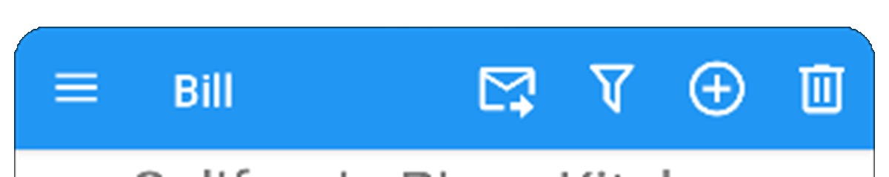

# Icons

Most DivisiBill pages include a tool bar at the top of the page, typically a colored background with the page title and icons in a contrasting color in the
foreground. For example:

The same icons are used on multiple pages. Here is a list of icons you may see (not all are used):

|Name                  | Icon
|----------------------|:---------------:|
| Add                  | <u>&#xF0419;</u>
| Back                 | <u>&#xF004D;</u>
| Camera               | <u>&#xF0D5d;</u>
| Cancel               | <u>&#xF073A;</u>
| Check (approve something) | <u>&#xF012C;</u>
| Close                | <u>&#xF0156;</u>
| Cloud File           | <u>&#xF0163;</u>
| Cloud On or Off      | <u>&#xF0163;</u> or <u>&#xF0164;</u>
| Decrement            | <u>&#xF0377;</u>
| Delete               | <u>&#xF0A7A;</u>

And so on...And on ...Version 1